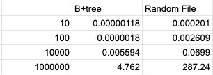
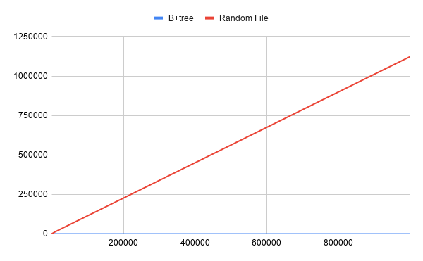
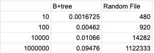
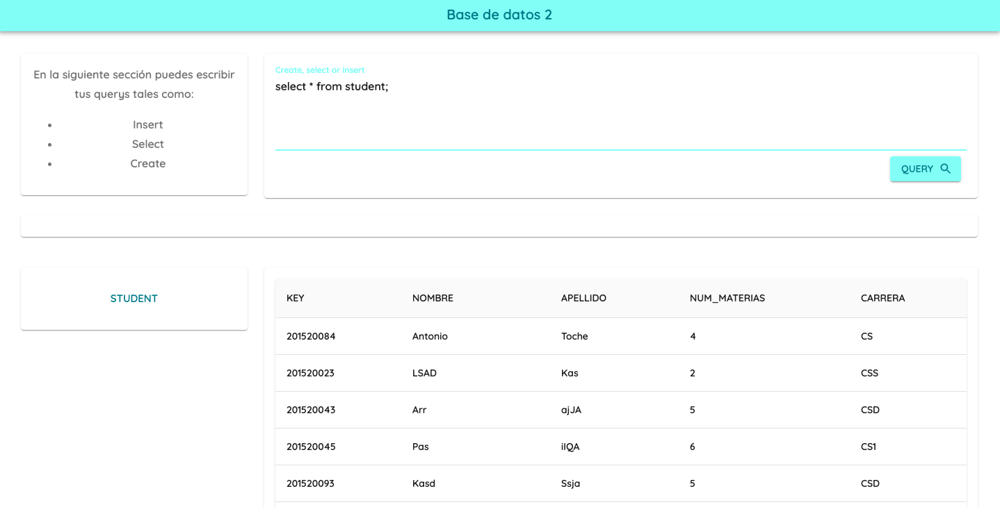

# MiniDb

Proyecto universitario que usa implementacion de b+tree en disco y un pequeño approach de sql lang para crear, seleccionar e insertar a la base de datos.
## Propósito
   Entender y aplicar los algoritmos de almacenamiento de archivos físicos y el acceso concurrente.

## Definiciones previas
- Registro: Es la representación de un conjunto de atributos de un objeto o entiendad en particular.
- Archivo: Es la representación de una secuencia de registros, donde podría existir un orden particular.
- Índice: El índice es el identificador asociado a un registro, donde se detalla su clave primaria y la posición donde se ubica el registro en el archivo de datos.
- Archivo de datos: Es el conjunto de registros representados a través de sus atributos. 
- Archivo de  índice: Es la representacíon del  índice basado en el archivo de datos. Por ejemplo: ”clave,posicion” para el caso del índice usando Random File.
- Memoria principal: La memoria principal es uno de los componentes más importantes del ordenador. Se utiliza durante el tiempo de ejecucíon del programa y con la pérdida de fluido eléctrico se pierde la información. Un ejemplo para referirse a la memoria principal sería la Ramdon Access Memory (RAM). Además, el tiempo de acceso es independiente de la dirección.
- Memoria secundaria: En la memoria secundaria se almacena data donde, a pesar de no existir fluido eléctrico, se conserva. Un ejemplo para refereirse a la memoria secundaria sería el Disco Duro (HDD) o Disco Sólido (SSD). Además, el tiempo de acceso es dependiente de la dirección.

## Resultadoas esperados
Se implemetará el b+ tree en disco y se hará un benchmarking vs random file para probar su efectividad al momento de indexar data. 

## Técnicas implementadas

### B+ Tree
 - Descripción: Se irá guardando en archivos de texto plano en la memoria secundaria. Conforme va incrementando la cantidad de registros los cuales se van ingresando en el programa se van creando los buckets necesarios, estos tambien archivos de texto plano. Se usará una key como medio de indexación.
 
### Random File
 - Descripción: Random File emplea un archivo de índice, basado en un diccionario, clave-posición.La clave indica el registro al que se refiere y posición hace referencia a la posición donde se ubica el registro en el archivo de datos
 
# Resultados experimentales

En el siguiente proyecto se ha realizado un benchamarking entre ambos algoritmos. Para cada uno de ellos se tomó el tiempo entre insercion y búsqueda con tamaños de array con 10, 100, 10000 y 1 000 000 datos respectivamente, consiguiendo los siguientes resultados:

## Inserción

 
 
 Como se puede visualizar claramente en la siguiente imagen la indexación por B+tree nos mejora varias veces más el rendimiento en consultas de tipo write.
 Los resultados fueron(ns):
  
 
 
 ## Búsqueda
 
 
 
  Como se puede visualizar claramente en la siguiente imagen la indexación por B+tree nos mejora varias veces más el rendimiento en consultas de tipo read.
   
 
 
 ## Uso
 
 Para poder ejecutar el proyecto primero ejecute el proyecto con:

    - $ go build
    
 Seguidamente aparecerá en el root del archivo un binario llamado igual que el paquete que está en go mod por lo que tendra que ejecutarlo
 
    - $ ./projectdb
   
 Para poder correr el client, debera entrar a la carpera llamada from usando

    - $ cd front/
    
 Seguidamente instalar los módulos y dependencias de node, en este caso puedes usar yarn con:

    - $ yarn
 
 y lanzar el proyecto con
 
    - $ yarn start
    
 Al finalizar tendrás el backend corriendo en el puerto 4200 y el cliente corriendo el puerto 3000
 ustéd podra ejecutar consultas simples de inserción, creacion de tablas y busqueda por atributos en el cliente y se mostrará de manera amigable.
 
La interaccion de ambos tiene la sigueinte interfaz:

 
 
 en esta podrás hacer consultas básicas, crear tablas y insertar datos en ellas.
 

## Conlusión

  - B+ tree es la manera más eficiente de indexar y guardar datos en memoria.
  - B+ tree es usado en la mayoría de base de datos como motor de indexación.
  - Random file es un metodo que si bien es cierto es más rápido de implementar, le performance que obtienes no es óptimo.
  - B+ tree está diseñado para su uso en datos almacenados en disco duro.
  - El B+ tree solo almacena registros, sus valores están en las hojas, es por eso que optimiza la búsqueda.
  - Los nodos están unidos entre sí lo que optimiza la búsqueda.

Podemos concluir que gracias al algoritmo usado para búsqueda e insercion de B+ tree este optimiza el tiempo de ejecucion. 

## Liberías externas

  - React
  - Material UI

 

